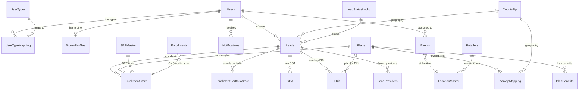

# ThinkAgent Data Instructions

> Comprehensive data model reference for generating ~1M+ MongoDB documents across 21 collections to power 11 Snowflake dashboards for a Medicare enrollment platform demo.

---

## Quick Reference

| Collection | Records | PK Field | Description |
|---|---|---|---|
| Users | 2,000 | NPN_Pk | Agents/brokers |
| UserTypes | 26 | UserTypeID | Static lookup (exact copy) |
| UserTypeMapping | 2,500 | UserTypeMappingId_Pk | User-type associations |
| BrokerProfiles | 600 | NPN | Agent public profiles |
| Leads | 100,000 | Pk_LeadID | Medicare prospects |
| LeadStatusLookup | 11 | LeadStatusId | Static lookup (exact copy) |
| Enrollments | 5,000 | Enrollment_Pk_Id | CMS confirmation records |
| EnrollmentStore | 150,000 | Enroll_PK_ID | Full enrollment applications (229 fields) |
| EnrollmentPortfolioStore | 40,000 | EnrollPortId_PK | Medigap/ANC enrollments (137 fields) |
| Plans | 5,000 | PK_PlanID | Medicare plan catalog |
| PlanBenefits | 6,000 | PK_KeyBenefitID | Plan benefit details (91 fields) |
| PlanZipMapping | 500,000 | PK_Plan_CZID | Plan geographic availability |
| CountyZip | 54,169 | (composite) | US ZIP/County/FIPS lookup |
| Events | 15,000 | Event_Pk_Id | Retail pharmacy events |
| LocationMaster | 10,000 | LocationMaster_Pk | CVS store locations |
| Retailers | 21 | Retailer_Id | Static lookup (exact copy) |
| SEPMaster | 30 | SEP_Id | SEP reason code lookup |
| SOA | 60,000 | SOAID_Pk_Id | Scope of Appointment records |
| EKit | 40,000 | EKIT_Pk_Id | Electronic enrollment kits |
| LeadProviders | 30,000 | LeadProvider_Pk_Id | Provider-lead associations |
| Notifications | 50,000 | NotificationDetail_Id_Pk | Agent notifications |

**Total: ~1,064,000 documents**

---

## Application Context

ThinkAgent is an Aetna/CVS Health Medicare insurance enrollment and sales platform used by agents/brokers to:
- Manage leads/prospects
- Search and compare Medicare plans (MA, MAPD, PDP, Medigap, Ancillary)
- Enroll members in Medicare Advantage, PDP, Medigap, Final Expense, and Ancillary products
- Manage retail events at CVS/pharmacy locations
- Track SOA (Scope of Appointment) compliance
- Send E-Kits (electronic enrollment kits) to prospects

Tech stack: Angular 15/Ionic frontend, Node.js/Express API, data originally in MSSQL Server.

---

## Entity Relationships



### Key Join Paths
- **Lead Journey**: `Leads.Pk_LeadID` → `SOA.LeadID` → `EKit.LeadID_Fk_Id` → `EnrollmentStore.LeadID_Fk`
- **Plan Details**: `Plans.PK_PlanID` → `PlanBenefits.FK_PlanID` → `PlanZipMapping.FK_PlanID`
- **Agent Link**: `Users.NPN_Pk` → `Leads.Created_By` → `EnrollmentStore.AgentNPN`
- **CMS Confirmation**: `Enrollments.ConfirmationNumber` = `EnrollmentStore.ConfNumber`
- **Event Location**: `Events.LocationMaster_Pk` → `LocationMaster.LocationMaster_Pk`

---

## Collection Schemas & Sample Documents

### 1. Users (2,000 records)

| Field | Type | Required | Description |
|---|---|---|---|
| NPN_Pk | string | Yes | National Producer Number (5-8 digits), primary key |
| First_name | string | Yes | Agent first name |
| Last_name | string | Yes | Agent last name |
| Email_Id | string | Yes | Format: `{first}.{last}@aetna.com` |
| Time_Zone | string | No | EST (98.9%), CST (0.5%), PST (0.3%), MST (0.1%) |
| User_Status | boolean | Yes | Active=99.9%, Inactive=0.1% |
| User_Access | boolean | Yes | Always true for active users |
| Created_Date | datetime | Yes | Account creation date |
| Created_By | string | Yes | Always "SYSTEM" |
| Updated_Date | datetime | Yes | Last update timestamp |
| Updated_By | string | Yes | Always "SYSTEM" |
| User_Id | string | Yes | Format: `{FirstInitial}{LastName}{3digits}` |
| In_Process | boolean | Yes | Default false |
| ResendPin_Act_Ind | boolean | Yes | Default false |
| RoleUpdate_Ind | boolean | Yes | Default false |
| UserTypeID | int | Yes | 1=General(43%), 4=Telesales(27%), 2=Internal Telesales(20%), rest(10%) |
| IsRegistered | boolean | Yes | Default true |
| Phone_number | string | No | 10-digit US phone |
| IsPhone_consent | boolean | No | ~70% true |

**Sample Document:**
```json
{
  "NPN_Pk": "115279",
  "First_name": "Jennifer",
  "Last_name": "Martinez",
  "Email_Id": "jennifer.martinez@aetna.com",
  "Time_Zone": "EST",
  "User_Status": true,
  "User_Access": true,
  "Created_Date": "2023-03-15T10:30:00Z",
  "Created_By": "SYSTEM",
  "Updated_Date": "2024-01-10T14:22:00Z",
  "Updated_By": "SYSTEM",
  "User_Id": "JMartinez230",
  "In_Process": false,
  "ResendPin_Act_Ind": false,
  "RoleUpdate_Ind": false,
  "UserTypeID": 1,
  "IsRegistered": true,
  "Phone_number": "2015559234",
  "IsPhone_consent": true
}
```

### 2. UserTypes (26 records — STATIC LOOKUP)

```json
[
  {"UserTypeID": 1, "UserType": "General"},
  {"UserTypeID": 2, "UserType": "Internal Telesales"},
  {"UserTypeID": 3, "UserType": "Strategic"},
  {"UserTypeID": 4, "UserType": "Telesales"},
  {"UserTypeID": 5, "UserType": "HealthSpire Net"},
  {"UserTypeID": 6, "UserType": "HealthSpire Tele"},
  {"UserTypeID": 7, "UserType": "HealthSpire Conv"},
  {"UserTypeID": 8, "UserType": "CSR Telesales"},
  {"UserTypeID": 9, "UserType": "Tele Enroller"},
  {"UserTypeID": 10, "UserType": "LH Agents"},
  {"UserTypeID": 11, "UserType": "Partner Intake"},
  {"UserTypeID": 12, "UserType": "MMS User"},
  {"UserTypeID": 13, "UserType": "Ignitist_HSConv"},
  {"UserTypeID": 14, "UserType": "Alight_HSConv"},
  {"UserTypeID": 15, "UserType": "Int_Field"},
  {"UserTypeID": 16, "UserType": "Alight_Tele"},
  {"UserTypeID": 17, "UserType": "Tranzact"},
  {"UserTypeID": 18, "UserType": "Reward Points"},
  {"UserTypeID": 19, "UserType": "SEP"},
  {"UserTypeID": 21, "UserType": "Salesforce SSO"},
  {"UserTypeID": 22, "UserType": "Int_Field_Hybrid"},
  {"UserTypeID": 23, "UserType": "HPOneAIT_Tele"},
  {"UserTypeID": 24, "UserType": "Bloom_Tele"},
  {"UserTypeID": 25, "UserType": "HPOne_ExtDTC"},
  {"UserTypeID": 26, "UserType": "Tranzact_ExtDTC"},
  {"UserTypeID": 27, "UserType": "HPOne_BPOTele"}
]
```

### 3. LeadStatusLookup (11 records — STATIC LOOKUP)

```json
[
  {"LeadStatusId": 1, "LeadStatusName": "New", "LeadStatusDescription": "New lead created", "IsActive": true, "SortOrder": 1},
  {"LeadStatusId": 2, "LeadStatusName": "Call Back", "LeadStatusDescription": "Scheduled callback", "IsActive": true, "SortOrder": 2},
  {"LeadStatusId": 3, "LeadStatusName": "SOA Created", "LeadStatusDescription": "SOA sent to beneficiary", "IsActive": true, "SortOrder": 3},
  {"LeadStatusId": 4, "LeadStatusName": "SOA Approved", "LeadStatusDescription": "SOA signed by beneficiary", "IsActive": true, "SortOrder": 4},
  {"LeadStatusId": 5, "LeadStatusName": "Not Interested", "LeadStatusDescription": "Lead declined", "IsActive": true, "SortOrder": 5},
  {"LeadStatusId": 6, "LeadStatusName": "eKit Sent", "LeadStatusDescription": "Electronic kit sent", "IsActive": true, "SortOrder": 6},
  {"LeadStatusId": 7, "LeadStatusName": "App Submitted", "LeadStatusDescription": "Application submitted", "IsActive": true, "SortOrder": 7},
  {"LeadStatusId": 8, "LeadStatusName": "App Sent for Sig", "LeadStatusDescription": "Awaiting signature", "IsActive": true, "SortOrder": 8},
  {"LeadStatusId": 9, "LeadStatusName": "Duplicate", "LeadStatusDescription": "Duplicate lead", "IsActive": true, "SortOrder": 9},
  {"LeadStatusId": 10, "LeadStatusName": "Do Not Contact", "LeadStatusDescription": "Opted out", "IsActive": true, "SortOrder": 10},
  {"LeadStatusId": 11, "LeadStatusName": "App Saved", "LeadStatusDescription": "Application saved as draft", "IsActive": true, "SortOrder": 11}
]
```

### 4. Leads (100,000 records)

| Field | Type | Required | Distribution |
|---|---|---|---|
| Pk_LeadID | uuid | Yes | Primary key |
| FirstName | string | Yes | Faker generated |
| LastName | string | Yes | Faker generated |
| Address1 | string | Yes | Street address |
| Address2 | string | No | 15% populated |
| City | string | Yes | |
| State | string | Yes | NY 22.5%, KY 16.1%, FL 10.8%, AR 4.8%, AL 3.4%, PA 2.2%, GA 2.0%, AZ 1.8%, TX 1.8%, CT 1.7% |
| County | string | Yes | Must match CountyZip |
| ZipCode | string | Yes | Must match State+County in CountyZip |
| DOB | date | Yes | 1930-1960 range (Medicare eligible 65+) |
| Gender | string | No | M 62%, F 18%, null 20% |
| Phone | string | Yes | 10-digit US |
| Email | string | No | 70% populated |
| LeadSource | string | No | MemberDirect 43%, PURL 33%, FTVT 13%, null 7%, Agent Connect 1% |
| LeadStatus | int | Yes | 1(New) 62%, 7(Submitted) 27%, 3(SOA Created) 4%, 6(eKit Sent) 3.3%, 8(App Sent) 1.6%, 11(Saved) 0.7%, 4(SOA Approved) 0.6%, 2(Callback) 0.4% |
| PermissionToContact | boolean | Yes | 85% true |
| MedicareNumber | string | Yes | MBI format (see Generation Rules) |
| PartA_Eff_Date | date | Yes | Typically when turning 65 |
| PartB_Eff_Date | date | Yes | Same or shortly after Part A |
| FIPS | string | Yes | 5-digit, must match CountyZip |
| Created_Date | datetime | Yes | Seasonal distribution |
| Created_By | string | Yes | Agent NPN (FK to Users) |
| CreatedUserTypeID | int | No | Matches agent's UserTypeID |

**Sample Document:**
```json
{
  "Pk_LeadID": "a1b2c3d4-e5f6-7890-abcd-ef1234567890",
  "FirstName": "Robert",
  "LastName": "Johnson",
  "Address1": "1234 Maple Street",
  "Address2": null,
  "City": "Rochester",
  "State": "NY",
  "County": "Monroe",
  "ZipCode": "14610",
  "DOB": "1952-07-15",
  "Gender": "M",
  "Phone": "5855551234",
  "Email": "rjohnson52@gmail.com",
  "LeadSource": "MemberDirect",
  "LeadStatus": 7,
  "PermissionToContact": true,
  "MedicareNumber": "1EG4TE5MK73",
  "PartA_Eff_Date": "2017-07-01",
  "PartB_Eff_Date": "2017-07-01",
  "FIPS": "36055",
  "IsExistingAetnaMember": false,
  "Created_Date": "2025-10-22T14:30:00Z",
  "Updated_Date": "2025-10-25T09:15:00Z",
  "Created_By": "115279",
  "Updated_By": "115279",
  "IsDeleted": false,
  "LisSubsidy": "N",
  "PlanType": "MAPD",
  "IsTobacco": false,
  "source": "FTVT",
  "CreatedUserTypeID": 1
}
```

### 5. EnrollmentStore (150,000 records — 229 fields)

**Critical Fields (~60):**

| Field | Type | Distribution |
|---|---|---|
| Enroll_PK_ID | uuid | Primary key |
| LeadID_Fk | uuid | FK to Leads |
| EnrollStatus | string | Submitted 93.6%, New 2.8%, Expired 2.4%, Saved 1.1% |
| PlanType | string | MAPD 93.7%, PDP 3.5%, MA 1.7%, PD 1.1% |
| BrandName | string | "Aetna Medicare" 97.9%, "AET" 0.8% |
| PlanYear | int | 2025 64.1%, 2023 18.5%, 2024 9.4%, 2026 2.4% |
| ElectionType | string | E 87.8%, S 5.5%, A 2.9%, I 1.8%, F 1.0% |
| MemberOrAgentEnroll | string | A (Agent) 81%, M (Member) 19% |
| OnlineOrEnroll | string | Online 99%, Offline 1% |
| EnrollmentSource | string | FTVT 96%, ThinkAgentURL_net 3%, CustomerCare 1% |
| SEPReasonCode | string | NEW 88%, LPI 4%, AEP 3%, MRD 1%, ICE 0.7% |
| Premium | string | Mostly "0" (Medicare $0 plans), some "$2.10"-"$200" |
| ConfNumber | string | Format: T{YY}{MM}{7digits}{letter} |
| ContractNumber | string | H5521, S5810, etc. |
| PBP | string | 3-digit "001"-"099" |
| CnInfFirstName..CnInfzipCode | string | Consumer demographics (mirrors Lead) |
| CnfInfMedicareNumber | string | MBI format |
| AgentNPN | string | FK to Users.NPN_Pk |
| Created_Date | datetime | Seasonal distribution with YoY growth |

Remaining ~170 fields: populated as null.

**Sample Document:**
```json
{
  "Enroll_PK_ID": "f1e2d3c4-b5a6-7890-abcd-ef0987654321",
  "LeadID_Fk": "a1b2c3d4-e5f6-7890-abcd-ef1234567890",
  "Premium": "0",
  "ContractNumber": "H5521",
  "PBP": "029",
  "PlanType": "MAPD",
  "BrandName": "Aetna Medicare",
  "PlanYear": 2025,
  "EnrollStatus": "Submitted",
  "MemberOrAgentEnroll": "A",
  "OnlineOrEnroll": "Online",
  "EnrollmentSource": "FTVT",
  "CnInfFirstName": "Robert",
  "CnInfLastName": "Johnson",
  "CnInfGender": "M",
  "CnInfDOB": "1952-07-15",
  "CnInfAddr1": "1234 Maple Street",
  "CnInfcity": "Rochester",
  "CnInfstate": "NY",
  "CnInfcounty": "Monroe",
  "CnInfzipCode": "14610",
  "CnInfPrimaryPhoneNumber": "5855551234",
  "CnfInfMedicareNumber": "1EG4TE5MK73",
  "ElectionType": "E",
  "SEPReasonCode": "NEW",
  "EPRequestEffectiveDate": "2026-01-01",
  "EPIsAEP": true,
  "Created_By": "115279",
  "Created_Date": "2025-10-25T16:45:00Z",
  "ConfNumber": "T251007543841A",
  "VerificationCode": "961775398",
  "AgentNPN": "115279",
  "AgentFirstName": "Jennifer",
  "AgentLastName": "Martinez",
  "SOA": "Y",
  "PmntInfInvoiceOrEFTOrSSAOrRRB": "SSA",
  "IsDeleted": false
}
```

### 6. Enrollments (5,000 records — CMS Confirmations)

Only ~4% of submitted EnrollmentStore records get a matching Enrollments record.
- ~3,000 match EnrollmentStore via `ConfirmationNumber = ConfNumber`
- ~2,000 from external sources (MISOC, DRX, Sunfire) with no EnrollmentStore match

| Field | Type | Distribution |
|---|---|---|
| ConfirmationNumber | string | T{YY}{MM}{7digits}{letter} |
| SourceApplication | string | Think Agent 62.6%, empty 20.8%, MISOC 4%, Flowtivity 3.5% |
| Enroll_Type | string | PPO 35%, DSNP 27%, POS 12%, HMO 10%, CSNP 6% |

### 7. Plans (5,000 records)

| Field | Type | Distribution |
|---|---|---|
| PK_PlanID | uuid | Primary key |
| Contract_Year | int | 2026=679, 2025=726, 2024=843, 2023=748 |
| Plan_Type | string | PPO 39%, HMO 14%, POS 14%, DSNP 11%, CSNP 7%, PDP 5% |
| Product | string | MAPD, MA, PDP |
| Plan_Origin | string | AET 95%, SSI 4%, JV-AH 1% |
| StarRating | string | "3"=17%, "3.5"=41%, "4"=32%, "4.5"=5%, null=5% |
| Market | string | 20 markets: Arizona, California, Capitol, Florida, Georgia/Gulf States, Great Lakes, Heartland, Keystone, Mid South, Midlands, Minnesota, Mountain, New England, New Jersey, New York, Northwest, Ohio/Kentucky, PDP, South Central, St. Louis |
| Plan_Name | string | "Aetna Medicare {Tier} ({Plan_Type})" |
| Contract_Number | string | H-prefix for MA/MAPD, S-prefix for PDP |

**Sample Document:**
```json
{
  "PK_PlanID": "b2c3d4e5-f6a7-8901-bcde-f12345678901",
  "Contract_Year": 2026,
  "Contract_Number": "H5521",
  "PBP": "029",
  "CP": null,
  "Plan_Origin": "AET",
  "Plan_Name": "Aetna Medicare Signature (PPO)",
  "Product": "MAPD",
  "Plan_Type": "PPO",
  "Commissionable": "Y",
  "Plan_Status": "Renewal",
  "Market": "New York",
  "Legal_Entity": "AETNA LIFE INSURANCE COMPANY",
  "Marketing_Name": "Aetna Medicare Signature (PPO)",
  "StarRating": "4",
  "IsDeleted": false
}
```

### 8. PlanBenefits (6,000 records — 91 fields)

Key fields: FK_PlanID (links to Plans), MedicalPremium (65% = "0"), DrugPremium (60% = "0"), IN_MOOP ($0-$9,250), plus 16 boolean flags (hasDental 95%, hasOTC 90%, hasFitness 85%, hasMeals 40%, hasPaymentCard 15%).

### 9. EnrollmentPortfolioStore (40,000 records — Medigap/ANC)

| Field | Distribution |
|---|---|
| PlanType | ANC 73%, MEDSUP 27% |
| ProductName | Medicare Supplement 26%, Hospital Indemnity Flex 17%, Final Expense 11%, Recovery Care 7%, DVH 7%, Cancer 5% |
| CompanyCode | CLI 71%, ACC 13%, AHLC 9%, AHIC 6% |
| EnrollStatus | Submitted 66%, Saved 25%, Awaiting Signature 5% |
| SourceOfEnrollment | add-portfolio 93%, Ekit 4% |

### 10. SOA (60,000 records)

| Field | Distribution |
|---|---|
| SOA_Status | 1(Sent/Pending) 94%, 2(Approved/Signed) 5.3%, 3(Rejected/Expired) 0.6% |
| MeetingType | homevisit 93%, telephonic 5.2%, other 1.1%, retail 0.9% |
| CommunicationMethod | 1(Email) 93%, 0=2.6%, 2(Phone) 2.4%, 3(Both) 1.7% |

### 11. EKit (40,000 records)

PlanType: primarily MAPD. PaymentFrequency: "MonthlyPremium". Source: "FTVT" or null.

### 12. Events (15,000 records)

| Field | Distribution |
|---|---|
| Event_Status | Scheduled 47%, Completed Not Verified 40%, Cancelled 11%, Completed Verified 1% |
| Event_Category | Retail 99.99%, Seminar 0.01% |
| Market | California 39%, Arizona 17%, NorthwestMountain 10%, Midlands 7%, Florida 6% |

### 13. LocationMaster (10,000 records)

CVS Pharmacy locations with NCPDP_ID, ZIP, Lat/Lng, Market, Territory.

### 14. Retailers (21 records — STATIC LOOKUP)

Major pharmacy/healthcare retailers: CVS, Walgreens, Walmart, Rite Aid, Kroger, etc.

### 15. SEPMaster (30 records — STATIC LOOKUP)

Key codes: AEP (A), NEW (E), ICE (I), OEP (M), MOV (V), MCD (U), DEP (Q), LEC (W), MRD (F), IEP (S), LT2/LTC (T), plus 18 more.

### 16. LeadProviders (30,000 records)

| Field | Distribution |
|---|---|
| Speciality | PCP 25%, Medical Center 7%, Other 4%, Urgent Care 4%, Facility 3%, Nurse Practitioner 2.5% |
| Group_Ind | I (Individual) 70%, G (Group) 30% |

### 17. Notifications (50,000 records)

| Field | Distribution |
|---|---|
| Notification_Type | REMINDER 86%, INFO 9%, ANNOUNCEMENT 4%, NOLEAD 1% |
| Status | UNREAD 93%, READ 7% |
| Navigation | Event_Detail 86%, Calendar 8%, null 4%, Leads 1% |

### 18. CountyZip (54,169 records)

Schema: `{ State, Zip_Code, County, county_fips }`
Covers all US zip codes. FIPS format: 2-digit state prefix + 3-digit county.

### 19. UserTypeMapping (2,500 records)

Maps Users to UserTypes. Schema: `{ UserTypeMappingId_Pk, NPN, UserTypeID, Is_Active, Created_Date, Created_By }`

### 20. BrokerProfiles (600 records)

Agent public profiles with address, contact info, bio text, social links.

### 21. PlanZipMapping (500,000 records)

Maps Plans to ZIP codes where they're available. ~100 ZIPs per plan.

---

## Data Generation Rules

### ID Formats
- **MBI (Medicare Beneficiary Identifier)**: `[1-9][A-Z*][A-Z0-9*][0-9][A-Z*][A-Z0-9*][0-9][A-Z*][A-Z0-9*][0-9][0-9]` (* excludes S,L,O,I,B,Z). Example: `1EG4TE5MK73`
- **NPN**: 5-8 digit numeric string
- **ConfirmationNumber**: `T{YY}{MM}{7digits}{letter}` — e.g., `T251007543841A`
- **VerificationCode**: 9-digit numeric string — e.g., `961775398`
- **UUIDs**: Standard v4 for all PK fields
- **DOB**: 1930-1960 range (Medicare eligible = 65+)

### Cascade Consistency Rules

Lead status determines which downstream collections MUST have records:

| LeadStatus | SOA Required | EKit Required | EnrollmentStore Required |
|---|---|---|---|
| 1 (New) | No | No | No |
| 2 (Call Back) | No | No | No |
| 3 (SOA Created) | Yes (Status=1 Pending) | No | No |
| 4 (SOA Approved) | Yes (Status=2 Approved) | No | No |
| 6 (eKit Sent) | Yes (Status=2) | Yes | No |
| 7 (App Submitted) | Yes (Status=2) | Optional | Yes (Status=Submitted) |
| 8 (App Sent for Sig) | Optional | Optional | Yes (Status=Awaiting Signature) |
| 11 (App Saved) | Optional | Optional | Yes (Status=Saved) |

**Chronological Ordering** (timestamps strictly ordered per lead journey):
```
Lead.Created_Date < SOA.Created_Date < SOA.BeneficiarySignatureDate < EKit.Created_Date < EnrollmentStore.Created_Date
```
Typical gaps: Lead→SOA: 0-7 days; SOA→EKit: 1-14 days; EKit→Enrollment: 1-30 days

**Agent Consistency**: Same NPN across a lead's entire journey.
**Geographic Consistency**: Lead's State/Zip/County consistent across SOA, EnrollmentStore. Enrolled plan must be available in lead's ZIP via PlanZipMapping.

### Agent Volume Distribution (Pareto)

| Agent Tier | % of Agents | % of Enrollments | Avg per Agent |
|---|---|---|---|
| Top 5% | 100 agents | 40% | ~600 |
| Next 15% | 300 agents | 30% | ~150 |
| Middle 30% | 600 agents | 20% | ~50 |
| Bottom 50% | 1,000 agents | 10% | ~15 |

Telesales agents (Types 2, 4, 6, 8) have higher volumes than General (Type 1).

### YoY Growth Pattern

| Year | Enrollments | Growth |
|---|---|---|
| 2023 | ~30,000 | Baseline |
| 2024 | ~34,500 | +15% |
| 2025 | ~41,400 | +20% |
| 2026 | ~15,000 | Partial year (Jan-Mar), on pace for +18% |

### Seasonal Enrollment Patterns

| Period | % of Year's Enrollments | Months |
|---|---|---|
| AEP (Annual Enrollment) | 60% | Oct 15 - Dec 7 |
| OEP (Open Enrollment) | 15% | Jan 1 - Mar 31 |
| SEP (Special Enrollment) | 20% | Scattered year-round |
| IEP (Initial Enrollment) | 5% | Varies by beneficiary |

### Enrollment-to-EnrollmentStore Ratio

Only ~4% of submitted EnrollmentStore records get a corresponding Enrollments (CMS confirmation) record. They join via `Enrollments.ConfirmationNumber = EnrollmentStore.ConfNumber`.

---

## Snowflake Dashboard Requirements

### Dashboard 1: Enrollment Trends (Time-Series)
- **Sources**: EnrollmentStore, EnrollmentPortfolioStore, Plans
- **Metrics**: Monthly volume, quarterly growth, YoY comparison
- **Viz**: Line chart, stacked area by plan type, sparklines per market

### Dashboard 2: Geographic Heatmap
- **Sources**: Leads, EnrollmentStore, Events, CountyZip
- **Metrics**: Enrollment density by state, lead concentration by county
- **Viz**: US choropleth map, bubble map, treemap

### Dashboard 3: Agent Performance Scorecard
- **Sources**: Users, UserTypeMapping, Leads, EnrollmentStore, SOA
- **Metrics**: Enrollments/agent, conversion rate, SOA approval rate
- **Viz**: Ranked bar chart, KPI cards, scatter plot

### Dashboard 4: Lead Pipeline Funnel
- **Sources**: Leads, SOA, EKit, EnrollmentStore, LeadStatusLookup
- **Metrics**: Lead count at each stage, drop-off rates
- **Viz**: Funnel chart, Sankey diagram, waterfall

### Dashboard 5: Plan & Product Mix
- **Sources**: Plans, EnrollmentStore, EnrollmentPortfolioStore
- **Metrics**: Enrollment share by plan type, top plans
- **Viz**: Donut chart, stacked bar, sunburst

### Dashboard 6: Retail Event Analytics
- **Sources**: Events, LocationMaster, Leads
- **Metrics**: Events per market, check-in rate, lead gen per event
- **Viz**: Calendar heatmap, bar chart, bubble map

### Dashboard 7: Portfolio (Medigap/ANC) Enrollment
- **Sources**: EnrollmentPortfolioStore, Plans, Leads
- **Metrics**: ANC vs MEDSUP volume, product ranking, premium distribution
- **Viz**: Horizontal bar, pie chart, box plot

### Dashboard 8: SOA Compliance & E-Kit Tracking
- **Sources**: SOA, EKit, Leads
- **Metrics**: SOA approval rate, meeting type breakdown, E-Kit volume
- **Viz**: Gauge chart, donut, stacked timeline

### Dashboard 9: Executive KPI Summary
- **Sources**: All collections aggregated
- **Metrics**: Total enrollments, leads, conversion rate, YoY growth
- **Viz**: KPI scorecards, sparklines, comparison bars

### Dashboard 10: Provider Network Analysis
- **Sources**: LeadProviders, Leads, CountyZip
- **Metrics**: Provider count by speciality, accepting-new-patients ratio
- **Viz**: Word cloud, stacked bar, network graph

### Dashboard 11: Plan Benefits Comparison
- **Sources**: PlanBenefits, Plans, EnrollmentStore
- **Metrics**: Premium by plan type, MOOP comparison, benefit availability rates
- **Viz**: Radar chart, heatmap matrix, box plot, grouped bar

---

## Data Generator

The Node.js data generator is located at `kafka-poc/data-generator/`.

### Setup & Usage
```bash
cd kafka-poc/data-generator
npm install

# Test run (~10K docs)
node index.js --scale=0.01

# Medium run (~100K docs)
node index.js --scale=0.1

# Full run (~1M docs)
node index.js

# Full run, drop existing data first
node index.js --drop

# Custom MongoDB URI
node index.js --uri=mongodb://localhost:27017/?replicaSet=rs0

# Custom database name
node index.js --db=thinkagent_db
```

### Generation Order (dependency-aware)
1. Static lookups: UserTypes, LeadStatusLookup, Retailers, SEPMaster
2. Users → UserTypeMapping → BrokerProfiles
3. CountyZip → LocationMaster
4. Plans → PlanBenefits → PlanZipMapping
5. Leads (with geographic consistency via CountyZip)
6. SOA, EKit, LeadProviders (referencing Leads, with cascade rules)
7. EnrollmentStore (referencing Leads + Plans, cascade + Pareto + seasonal)
8. Enrollments (4% subset of submitted EnrollmentStore)
9. EnrollmentPortfolioStore
10. Events (referencing LocationMaster)
11. Notifications

---

## Snowflake Pipeline Notes

### Pipeline Configuration
- MongoDB Source Connector watches entire `poc_db` database (all collections auto-detected)
- Snowflake Sink Connector uses `topics.regex=mongo\\.poc_db\\..*` to auto-subscribe
- Topic-to-table mapping configured for all 21 collections with clean Snowflake table names
- Buffer settings tuned for bulk: 5000 records / 120s / 20MB

### Partition Keys (for Snowflake clustering)
- `Created_Date` — time-series analytics
- `PlanYear` — plan year comparisons
- `State` / `Market` — geographic analytics

### Cross-Table Join Keys in Snowflake

| Join | Left Table.Column | Right Table.Column |
|---|---|---|
| Lead → Enrollment | LEADS.Pk_LeadID | ENROLLMENT_STORE.LeadID_Fk |
| Lead → SOA | LEADS.Pk_LeadID | SOA.LeadID |
| Lead → EKit | LEADS.Pk_LeadID | EKIT.LeadID_Fk_Id |
| Lead → Portfolio | LEADS.Pk_LeadID | ENROLLMENT_PORTFOLIO_STORE.LeadID_Fk |
| Lead → Provider | LEADS.Pk_LeadID | LEAD_PROVIDERS.LeadID_Fk_Id |
| Plan → Benefits | PLANS.PK_PlanID | PLAN_BENEFITS.FK_PlanID |
| Plan → ZipMapping | PLANS.PK_PlanID | PLAN_ZIP_MAPPING.FK_PlanID |
| Plan → Enrollment | PLANS.PK_PlanID | ENROLLMENT_STORE.PlanID |
| Agent → Lead | USERS.NPN_Pk | LEADS.Created_By |
| Agent → Enrollment | USERS.NPN_Pk | ENROLLMENT_STORE.AgentNPN |
| Agent → Notification | USERS.NPN_Pk | NOTIFICATIONS.RecipientNPN |
| CMS Confirm | ENROLLMENTS.ConfirmationNumber | ENROLLMENT_STORE.ConfNumber |
| Event → Location | EVENTS.LocationMaster_Pk | LOCATION_MASTER.LocationMaster_Pk |
| Lead Status | LEADS.LeadStatus | LEAD_STATUS_LOOKUP.LeadStatusId |
| SEP Code | ENROLLMENT_STORE.SEPReasonCode | SEP_MASTER.SEP_code |
| User Type | USERS.UserTypeID | USER_TYPES.UserTypeID |

### Verification Queries

After data generation:
```javascript
// MongoDB verification
db.getCollectionNames().forEach(c => print(c + ": " + db[c].countDocuments()));
```

After pipeline sync:
```sql
-- Snowflake verification
SELECT 'USERS' as tbl, COUNT(*) as cnt FROM POC_DB.MONGO_SYNC.USERS
UNION ALL SELECT 'LEADS', COUNT(*) FROM POC_DB.MONGO_SYNC.LEADS
UNION ALL SELECT 'ENROLLMENT_STORE', COUNT(*) FROM POC_DB.MONGO_SYNC.ENROLLMENT_STORE
UNION ALL SELECT 'PLANS', COUNT(*) FROM POC_DB.MONGO_SYNC.PLANS
-- ... repeat for all 21 tables

-- Spot-check distributions
SELECT RECORD_CONTENT:PlanType::STRING as plan_type, COUNT(*) as cnt
FROM POC_DB.MONGO_SYNC.ENROLLMENT_STORE
GROUP BY 1 ORDER BY 2 DESC;
-- Expected: MAPD ~94%, PDP ~3.5%, MA ~1.7%

SELECT RECORD_CONTENT:State::STRING as state, COUNT(*) as cnt
FROM POC_DB.MONGO_SYNC.LEADS
GROUP BY 1 ORDER BY 2 DESC LIMIT 10;
-- Expected: NY ~22%, KY ~16%, FL ~11%
```
