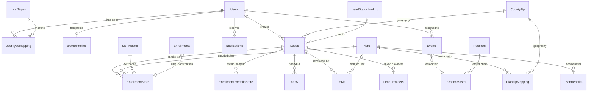

# ThinkAgent Data Generation Instruction File (Detailed Plan)

## Purpose

This instruction file will be consumed by an AI system to generate **massive realistic data** in a new MongoDB database. The data will then be piped into **Snowflake** for a dashboard analytics POC. Therefore the data must be:

- **High volume** (100K+ enrollment records, 50K+ leads, 10K+ events, etc.)
- **Analytically rich** with realistic distributions across states, plan types, statuses, time periods
- **Internally consistent** with valid cross-collection references (Lead -> Enrollment -> Plan -> Geography)
- **Dashboard-friendly** with date ranges suitable for time-series, geographic, and categorical analytics

## Output File

**[Flowtivity_ftvtapp-oci/THINKAGENT_DATA_INSTRUCTIONS.md](Flowtivity_ftvtapp-oci/THINKAGENT_DATA_INSTRUCTIONS.md)**

---

## Section 1: Application Context

ThinkAgent is an Aetna/CVS Health Medicare insurance enrollment and sales platform used by agents/brokers to:

- Manage leads/prospects
- Search and compare Medicare plans (MA, MAPD, PDP, Medigap, Ancillary)
- Enroll members in Medicare Advantage, PDP, Medigap, Final Expense, and Ancillary products
- Manage retail events at CVS/pharmacy locations
- Track SOA (Scope of Appointment) compliance
- Send E-Kits (electronic enrollment kits) to prospects

Tech stack: Angular 15/Ionic frontend, Node.js/Express API, original data in MSSQL Server.

---

## Section 2: MongoDB Collections (21 Collections)

### Target Data Volumes for Snowflake Dashboard POC

- `Users` - 2,000 records (agents/brokers)
- `UserTypes` - 26 records (static lookup, exact copy)
- `UserTypeMapping` - 2,500 records
- `BrokerProfiles` - 600 records
- `Leads` - 100,000 records
- `LeadStatusLookup` - 11 records (static lookup, exact copy)
- `Enrollments` - 5,000 records (CMS confirmation records -- subset of submitted EnrollmentStore)
- `EnrollmentStore` - 150,000 records (the main enrollment application table)
- `EnrollmentPortfolioStore` - 40,000 records (Medigap/ANC enrollments)
- `Plans` - 5,000 records (across years 2023-2026, includes StarRating field)
- `PlanBenefits` - 6,000 records (plan benefit details: premiums, deductibles, MOOP, benefit flags)
- `PlanZipMapping` - 500,000 records
- `CountyZip` - 54,169 records (full US geography)
- `Events` - 15,000 records (includes Lead_Count_Summary for event->lead metrics)
- `LocationMaster` - 10,000 records (CVS store locations)
- `Retailers` - 21 records (static lookup, exact copy)
- `SEPMaster` - 30 records (static lookup -- decodes SEP reason codes to labels/election types) **NEW**
- `SOA` - 60,000 records
- `EKit` - 40,000 records
- `LeadProviders` - 30,000 records
- `Notifications` - 50,000 records

**Total: ~1M+ documents across 21 collections**

---

## Section 3: Detailed Schema + Distributions + Sample Data Per Collection

The instruction file will contain the following for EACH of the 19 collections:

### 3.1 Users Collection (from TA_USERS)

- **Full schema**: 19 fields with types (NPN_Pk string PK, First_name, Last_name, Email_Id, Time_Zone, User_Status boolean, User_Access boolean, Created_Date, Created_By, Updated_Date, Updated_By, User_Id, In_Process, ResendPin_Act_Ind, RoleUpdate_Ind, UserTypeID, IsRegistered, Phone_number, IsPhone_consent)
- **Distribution data from QA**:
  - Time zones: EST (98.9%), CST (0.5%), PST (0.3%), MST (0.1%), null (0.2%)
  - User_Status: Active=99.9%, Inactive=0.1%
  - NPN format: 5-8 digit string, e.g. "115279", "98234572", "1000001"
  - Email pattern: `{lastname initial}{firstname}@aetna.com` or `{firstname}.{lastname}@aetna.com`
  - User_Id pattern: `{FirstInitial}{LastName}{3digits}` e.g. "AGupta230", "MinorC1862"
- **10+ sample documents** from actual QA data (sanitized)

### 3.2 UserTypes Collection (from TA_UserTypes) - STATIC LOOKUP

- All 26 records will be included verbatim:
  - 1=General, 2=Internal Telesales, 3=Strategic, 4=Telesales, 5=HealthSpire Net, 6=HealthSpire Tele, 7=HealthSpire Conv, 8=CSR Telesales, 9=Tele Enroller, 10=LH Agents, 11=Partner Intake, 12=MMS User, 13=Ignitist_HSConv, 14=Alight_HSConv, 15=Int_Field, 16=Alight_Tele, 17=Tranzact, 18=Reward Points, 19=SEP, 21=Salesforce SSO, 22=Int_Field_Hybrid, 23=HPOneAIT_Tele, 24=Bloom_Tele, 25=HPOne_ExtDTC, 26=Tranzact_ExtDTC, 27=HPOne_BPOTele

### 3.3 UserTypeMapping Collection

- **Schema**: UserTypeMappingId_Pk (uuid), NPN (string), UserTypeID (int), Is_Active (boolean), Created_Date, Created_By, Updated_Date, Updated_By
- **Distribution**: Type 1 (General) 43%, Type 4 (Telesales) 27%, Type 2 (Internal Telesales) 20%, rest 10%

### 3.4 BrokerProfiles Collection (from TA_BROKER_PROFILE)

- **Schema**: 25 fields including NPN, BrokerFirstName, BrokerLastName, BrokerMiddleName, County, BrokerAddressLine1/2, BrokerAddressCity, BrokerAddressStateCd, BrokerAddressZipCd, BrokerContactPhone, BrokerContactEmail, Disclaimer, IsApproved, AboutUs, LinkedIn, Instagram, Facebook, mbr_AboutUs, ImageURL, StartTime, EndTime, NewImageURL, ShortURL, AgentStatusID, IsProfileSharing
- **Sample AboutUs text**: Standard Aetna agent bio paragraph included

### 3.5 Leads Collection (from TA_Enrollment_Leads) -- MAJOR TABLE

- **Schema**: 37 fields (Pk_LeadID uuid, FirstName, LastName, Address1, Address2, City, State, County, ZipCode, DOB, Gender, Phone, Email, LeadSource, LeadStatus, PermissionToContact, MedicareNumber, PartA_Eff_Date, PartB_Eff_Date, FIPS, IsExistingAetnaMember, Created_Date, Updated_Date, Created_By, Updated_By, IsDeleted, OfflineLeadID, LisSubsidy, MedicaidNumber, PlanType, CallBackNumber, Ethnicity, Race, IsMobileNumber, IsTobacco, source, CreatedUserTypeID)
- **State distribution** (top 10): NY 22.5%, KY 16.1%, FL 10.8%, AR 4.8%, AL 3.4%, PA 2.2%, GA 2.0%, AZ 1.8%, TX 1.8%, CT 1.7%
- **Lead status distribution**: 1(New) 62%, 7(App Submitted) 27%, 3(SOA Created) 4%, 6(eKit Sent) 3.3%, 8(App Sent for Sig) 1.6%, 11(App Saved) 0.7%, 4(SOA Approved) 0.6%, 2(Call Back) 0.4%
- **Gender**: M 62%, F 18%, empty/null 20%
- **LeadSource**: MemberDirect 43%, PURL 33%, FTVT 13%, None 7%, Agent Connect 1%, Self Generated 1%, MCIX 0.6%
- **CreatedUserTypeID**: mostly 1 (General)
- **10+ sample documents** from QA data

### 3.6 LeadStatusLookup - STATIC (11 records, exact copy provided)

### 3.7 Enrollments Collection (from TA_Enrollment)

- **Schema**: 49 fields (Enrollment_Pk_Id, ConfirmationNumber, EffectiveDate, Agent_APP_USERID, AgentNPN, AgentFirstName, AgentLastName, SourceApplication, Created_Date, SFDCID, Contract_Number, PBP, Plan_Name, Election_Period, First_Name, Middle_Initial, Last_Name, Gender, DOB, Phone, Email, Primary_Address1/2, Primary_City/State/Zip/County, PCP_ID, Provider_First/Last_Name, Provider_Address/City/State/Zip, Medicare_Number, Nursing_Home, Is_Medicaid, Enroll_Type, Initiated_Through, VBE_Requested_Date, Date_Of_Enrollment, Enrollment_Agent_NPN)
- **SourceApplication distribution**: Think Agent 62.6%, empty 20.8%, MISOC 4%, Flowtivity 3.5%, Partner 2.4%, Sunfire 1.9%, DRX 1.2%, ThinkAgent 0.9%, Ascend 0.7%
- **Enroll_Type distribution**: PPO 35%, DSNP 27%, POS 12%, HMO 10%, CSNP 6%, MAPD 3%, DSNP(HIDE) 3%
- **ConfirmationNumber pattern**: "T{YYMM}{7digits}{letter}" e.g. "T12600754384A"
- **10+ sample documents**

### 3.8 EnrollmentStore Collection (from TA_Enrollment_Store) -- BIGGEST TABLE (229 fields)

- **Full schema**: All 229 columns documented with types
- **Key field distributions**:
  - EnrollStatus: Submitted 93.6%, New 2.8%, Expired 2.4%, Saved 1.1%, Deleted 0.06%, Awaiting Signature 0.04%, Cancelled 0.03%
  - PlanType: MAPD 93.7%, PDP 3.5%, MA 1.7%, PD 1.1%
  - BrandName: "Aetna Medicare" 97.9%, "AET" 0.8%, "Aetna Better Health of NJ" 0.3%, "Aetna Better Health of VA" 0.3%
  - PlanYear: 2025 64.1%, 2023 18.5%, 2024 9.4%, 2022 4.9%, 2026 2.4%
  - ElectionType: E 87.8%, S 5.5%, A 2.9%, I 1.8%, F 1.0%
  - MemberOrAgentEnroll: A (Agent) 81%, M (Member) 19%
  - OnlineOrEnroll: Online 99%, Offline 1%
  - EnrollmentSource: FTVT 96%, ThinkAgentURL_net 3%, CustomerCare 1%
  - SEPReasonCode: NEW 88%, LPI 4%, AEP 3%, MRD 1%, ICE 0.7%
  - Premium: mostly 0 (Medicare plans with $0 premium), some with values
- **Critical fields to always populate** (~60 of 229): Enroll_PK_ID, LeadID_Fk, Premium, ContractNumber, PBP, PlanType, BrandName, PlanYear, EnrollStatus, MemberOrAgentEnroll, OnlineOrEnroll, EnrollmentSource, CnInfFirstName, CnInfLastName, CnInfGender, CnInfDOB, CnInfAddr1, CnInfcity, CnInfstate, CnInfcounty, CnInfzipCode, CnInfPrimaryPhoneNumber, CnInfEmailAddress, CnfInfMedicareNumber, CnfInfPartAEffDate, CnfInfPartBEffDate, ElectionType, SEPReasonCode, EPRequestEffectiveDate, EPIsAEP, Created_By, Created_Date, Updated_Date, VerificationCode, ConfNumber, Ethnicity, Race, SOA, MediaType, isTAConversion, PmntInfInvoiceOrEFTOrSSAOrRRB, OthrInfIsMedicaidEnroll, OthrInfMedicaidNumber, OthrInfIsLTC, OthrInfOthrLang, AgentSignature, MemberSignature, MemberSignatureDate, IsDeleted, DoesWork, DoesSpouseWork
- **Remaining ~170 fields**: populated as null or with reasonable defaults
- **10+ sample documents** with realistic field patterns

### 3.9 EnrollmentPortfolioStore (from TA_EnrollmentPortfolioStore) -- 137 fields

- **Full schema** documented
- **Key distributions**:
  - PlanType: ANC 73%, MEDSUP 27%
  - ProductName: Medicare Supplement 26%, Hospital Indemnity Flex 17%, Final Expense 11%, Recovery Care 7%, Dental Vision Hearing 7%, Protection Series FE 6%, Cancer Insurance 5%, DVH Plus 5%, Heart Attack/Stroke 4%, DVH Flex 4%, Home Care Plus 4%
  - CompanyCode: CLI 71%, ACC 13%, AHLC 9%, AHIC 6%
  - EnrollStatus: Submitted 66%, Saved 25%, Awaiting Signature 5%, Awaiting Agent signature 3%
  - SourceOfEnrollment: add-portfolio 93%, Ekit 4%, PURLFlow 1.4%, FTVT 0.5%
- **Key fields to populate**: EnrollPortId_PK, LeadID_Fk, PlanType, RequestEffectiveDate, PaymentMode, ModalPremium, ApplicantName, ApplicantPhoneNum, ApplicantGender, ApplicantDOB, ApplicantZipCode, ApplicantState, ApplicantCity, ApplicantMedicareNum, MedicareEffectivePartA, MedicareEffectivePartB, ApplicationType, EnrollStatus, PlanName, ProductName, CompanyCode, SourceOfEnrollment, SbtApplicantSignDate, SbtAgentSignDate, CreatedBy, CreatedDate
- **10+ sample documents**

### 3.10 Plans Collection (from TA_All_Plans + StarRating from MAPD_PlanBenefits_Stage_StarRating)

- **Schema**: 20 fields (PK_PlanID uuid, Contract_Year int, Contract_Number, PBP, CP, Plan_Origin, Plan_Name, Product, Plan_Type, Commissionable, Plan_Status, Market, Legal_Entity, Marketing_Name, Insert_DTS, Update_DTS, Insert_User_ID, UPDATE_User_ID, IsDeleted, **StarRating** string -- CMS star rating "3", "3.5", "4", "4.5")
- **StarRating distribution** (added from MAPD_PlanBenefits_Stage_StarRating): 3.0 stars=17%, 3.5 stars=41%, 4.0 stars=32%, 4.5 stars=5%, null=5%. Assigned at Contract_Number level (all PBPs under same contract share same rating)
- **Distribution by year**: 2026=679 plans, 2025=726, 2024=843, 2023=748
- **Plan_Type x Product** breakdown (2026): PPO/MAPD=256, HMO/MAPD=96, POS/MAPD=92, DSNP/MAPD=75, CSNP/MAPD=44, PDP/PDP=33, PPO/MA=28, DSNP(HIDE)/MAPD=26, POS/MA=7
- **Plan_Origin**: AET (Aetna) 95%, SSI (SilverScript) 4%, JV-AH (Joint Venture Allina Health) 1%
- **Plan_Status**: "Renewal" or "New Plan"
- **Market** (20 values): Arizona, California, Capitol, Florida, Georgia/Gulf States, Great Lakes, Heartland, Keystone, Mid South, Midlands, Minnesota, Mountain, New England, New Jersey, New York, Northwest, Ohio/Kentucky, PDP, South Central, St. Louis
- **Legal_Entity** (40+ values): AETNA LIFE INSURANCE COMPANY, AETNA HEALTH INC. (state), AETNA BETTER HEALTH (state), COVENTRY HEALTH CARE, ALLINA HEALTH AETNA MEDICARE, SILVERSCRIPT INSURANCE COMPANY
- **Plan_Name patterns**: "Aetna Medicare {Plan Level} ({Plan Type})" e.g. "Aetna Medicare Signature (PPO)", "Aetna Medicare Enhanced (PPO)", "Aetna Medicare Value (HMO)"
- **Contract_Number patterns**: H-prefix 5-digit e.g. "H5521", "H1692", S-prefix for PDP e.g. "S5810"
- **10+ sample documents** from 2026 plan year

### 3.11 PlanZipMapping (from TA_Plan_Zip)

- **Schema**: PK_Plan_CZID uuid, State, County, Zip, Multi_County_Zip, Insert_DTS, Update_DTS, Insert_User_ID, UPDATE_User_ID, IsDeleted, FK_PlanID (uuid reference to Plans)
- Each plan is available in multiple zip codes; average ~500 zip codes per plan

### 3.12 CountyZip (from County_Zip)

- **Schema**: State, Zip_Code, County, county_fips
- 54,169 records covering all US zip codes
- To be copied in full or near-full

### 3.13 Events Collection (from TA_Events) -- 47 fields

- **Full schema** documented
- **Distributions**:
  - Event_Status: Scheduled 47%, Completed Not Verified 40%, Cancelled 11%, Completed Verified 1%, Pending Cancellation Approval 0.5%, Completed Reported 0.03%
  - Event_Category: Retail 99.99%, Seminar 0.01%
  - Market distribution: California 39%, Arizona 17%, NorthwestMountain 10%, Midlands 7%, Florida 6%, GreatLakes 4%, GeorgiaGulfStates 4%, Capitol 3%
  - Venue_Name: primarily "CVS PHARMACY"
  - Event time patterns: Start 8AM-6PM, End 1-6 hours after start
  - SF_Id pattern: "a03WB00000{alphanumeric}"
  - Seminar_Id pattern: "S-{7digits}"
  - Retail_Event_ID pattern: "E-{6digits}"
- **10+ sample documents**

### 3.14 LocationMaster (from TA_LocationMaster) -- 24 fields

- **Schema**: LocationMaster_Pk int, NCPDP_ID int, ZIP, Latitude, Longitude, Location_Status boolean, TZ_ID, TZ_Name, TZ_Offset, Pharmacy, Retailer, Phone, CanDoEvent, Address1, City, County, StoreState, Market, TerritoryId, TerritoryName, Created_Date, Created_By, Updated_Date, Updated_By
- Primarily CVS Pharmacy locations; Pharmacy="CVS PHARMACY", Retailer="CVS"
- **5+ sample documents**

### 3.15 Retailers - STATIC (21 records, exact copy)

- Full data: Aetna Medicare, Anthem, BCBS, Centene, Cigna, Humana, Kaiser Permanente, UnitedHealthcare, WellCare, Others, Unknown
- Retailer_Type: DETAIL or SUMMARY
- Event_Category: Retail or Seminar

### 3.16 SOA Collection (from TA_Enrollment_Lead_SOA) -- 33 fields

- **Full schema**: SOAID_Pk_Id, LeadID, FirstName, LastName, Phone, Email, Address, City, State, County, ZipCode, InitialMethodOfContact, PlansToPresent, ReasonForNotSigningBeforeMeeting, AgentSignature, RequestedMeetingDate, BeneficiarySignature, BeneficiarySignatureDate, BeneRepresentativeName, RelationshipWithBene, CommunicationMethod, SOA_Status, IsDeleted, Created_Date, Created_By, Updated_Date, SOA_Created_Date, Initials, AgentPhone, MeetingType, MeetingTime, SOASentCounter, BeneficiaryAddress1/2/City/State/County/ZipCode, IsF2F, VerificationCode, CreatedUserTypeID
- **Distributions**:
  - SOA_Status: 1(Sent/Pending)=94%, 2(Approved/Signed)=5.3%, 3(Rejected/Expired)=0.6%
  - MeetingType: homevisit 93%, telephonic 5.2%, other 1.1%, retail 0.9%
  - CommunicationMethod: 1(Email)=93%, 0=2.6%, 2(Phone)=2.4%, 3(Both)=1.7%
  - SOASentCounter: typically 1-3
  - VerificationCode: 9-digit numeric string e.g. "961775398"
- **10+ sample documents**

### 3.17 EKit Collection (from TA_Enrollment_Lead_EKIT) -- 29 fields

- **Full schema**: EKIT_Pk_Id, LeadID_Fk_Id, PlanID_Fk_Id, Document_Fk_Id, IsActive, IsDeleted, Created_Date, Created_By, Updated_Date, Updated_By, VerificationCode, Contract_Year, Contract_Number, PBP, AgentMessage, CommunicationPref, PlanID, PlanName, Email, PhoneNumber, EKITSentCounter, Premium, AgentPhone, LisSubsidy, StateChannelProductID, PlanType, PaymentFrequency, SubmittedUserTypeId, source, IsMultipleEkit, EkitRCCFileName, EKIT_PDF, FTVTDepartmentId
- **PlanType**: primarily MAPD
- **PaymentFrequency**: "MonthlyPremium" is standard
- **source**: "FTVT" or null
- **10+ sample documents**

### 3.18 LeadProviders Collection (from TA_Enrollment_Lead_Provider) -- 21 fields

- **Full schema**: LeadProvider_Pk_Id, LeadID_Fk_Id, Provider_Identification_Number, Provider_Name, Service_Location_Building_Name, Service_Location_Street_1, Service_Location_City_Name, Service_Location_Zip_Code, Service_Location_County_Name, Service_Location_State_Name, NPI_Number, Accepting_New_Patients_Indicator, Cap_Id, Speciality, IsDeleted, ID, Insr_Via_Provider_Name, High_Value_Provider, Group_Ind, AddressId, Preferred_Provider
- **Speciality distribution**: PCP 25%, Medical Center 7%, Other 4%, Urgent Care 4%, Facility 3%, Nurse Practitioner 2.5%, Physical Therapy 2%, Hospital 2%, Cardiology 2%, Surgery 1.4%, Physician Assistant 1.4%, Orthopedics 1.1%, Lab 1.1%, Hospice 1%, Chiropractic 1%, Podiatry 0.8%, Walk-in Clinic 0.8%, OB-GYN 0.7%, Ophthalmology 0.7%, Gastroenterology 0.6%
- **Provider_Name pattern**: "LastName, FirstName MiddleInitial, {Credential}" e.g. "Johnson, Emily A., MSN"
- **Group_Ind**: "I" (Individual) or "G" (Group)
- **10+ sample documents**

### 3.19 SEPMaster Collection (from TA_Enrollment_SEP_Master) -- STATIC LOOKUP **NEW**

- **Schema**: SEP_Id (int), SEP_code (string), Election_type (string), SEP_label (string), Is_date_required (boolean), Date_label (string), Category_id (int), SubCategory_id (int), Sort_order (int), Is_active (boolean)
- All 30 active records will be included verbatim. Key SEP codes:
  - AEP (Election: A) - Annual Enrollment Period Oct 15 - Dec 7
  - NEW (Election: E) - New to Medicare
  - ICE (Election: I) - Already has Part A, recently got Part B
  - OEP (Election: M) - Open Enrollment Period, in MA plan wanting change
  - MOV (Election: V) - Moved to new address outside plan service area
  - MCD (Election: U) - Change in Medicaid status
  - DEP (Election: Q) - Dual-eligible/Extra Help quarterly enrollment
  - LEC (Election: W) - Left employer coverage
  - MRD (Election: F) - Had Medicare prior, now turning 65
  - IEP (Election: S) - Initial Enrollment Period, had Medicare before turning 65
  - LT2/LTC (Election: T) - Long-term care facility
  - Plus 19 more SEP reason codes (RET, PRE, RUS, INC, LAW, IND, DST, LCC, MYT, PAC, SNP, EOC, CSN, NLS, DIF, PAP, etc.)
- **Purpose**: Decodes EnrollmentStore.SEPReasonCode into human-readable labels for Dashboard 1 (Enrollment Trends) and filters

### 3.20 PlanBenefits Collection (from TA_KeyPlanBenefits) -- 91 fields

- **Schema**: 91 fields including PK_KeyBenefitID (uuid), FK_PlanID (uuid ref to Plans), SegmentID, PlanNameText, PlanName, DrugPremium, DrugDeductible, ICLLimit, MedicalPremium, IN_MOOP, Only_Combined_MOOP, MedicalDeductible, OON_MedDeductible, FormularyID, CombinedMOOP, LimitedNetwork, VisitorTravelerProgram, PartBPremiumReduction, PCP, Specialist, InpatientHospital, ER, Ambulance, AmbulatorySurgicalCenter, HomeHealthCare, DME, DiabeticMonitoringSupplies, LabServices, DiagnosticProcedures, Imaging, PreventiveBenefits, AnnualPhysical, Fitness, AlternativeTherapies, Meals, Transportation, OTC, DentalCoverage, EyewearCoverage, HearingAidCoverage, DentalProviderDirectoryLink, RxMOOP, AdditionalGapCoverage, SNF, OutpatientMentalHealth, ChiropracticRoutineServices, OSB1-4 fields (Optional Supplemental Benefit tiers), AdditionalTelehealthServices, TherapeuticMassage, VBIDLIS, HRA, CustomerServiceHours, PlanPhone, PhysicianSearchURL, PlanType, SubType, MarketingName, WebsiteURL, PlanTTY, MedicalDeductiblePlanCard, AcupunctureRoutineServices, PaymentCard + 16 boolean flags: hasDental, hasEyewear, hasHearingAid, hasOTC, hasTelehealth, has0$Premium, has0$PCP, hasLabServices, hasMeals, hasVisitorTravelerProgram, hasAcupuncture, hasChiropractic, hasPartBPremiumRed, hasFitness, hasWorldWideUrgentEmergentCare, hasPaymentCard
- **QA data**: 1,359 records linked to Plans via FK_PlanID
- **Key distributions**:
  - MedicalPremium: mostly "0" (~65%), then ranges $2-$200/month
  - DrugPremium: mostly "0" (~60%), then ranges $5-$50/month
  - IN_MOOP: ranges $0-$9,250, median ~$5,000
  - has0$Premium: ~65% true
  - has0$PCP: ~80% true
  - hasDental: ~95% true
  - hasOTC: ~90% true
  - hasFitness: ~85% true
  - hasMeals: ~40% true
  - hasPaymentCard: ~15% true
- **PlanName patterns**: "Aetna {Brand} {Tier} ({PlanType}) {ContractNumber}-{PBP}" e.g. "Aetna Medicare Advantra (PPO) H1608-029"
- **Premium text formats**: Dollar amounts as strings "0", "2.1", "33.9"; copay text like "$0", "$35", "In-Network\n$0"
- **10+ sample documents** from QA data showing full benefit coverage details

### 3.20 Notifications Collection (from TA_Notification_Detail) -- 23 fields

- **Full schema**: NotificationDetail_Id_Pk, Sent_Date, RecipientNPN, Status, IsDeleted, FCM_ID, FCM_Status, Detailed_Subject, Detailed_Body, Created_Date, Created_By, Updated_Date, Updated_By, Event_Code, Notification_Type, BatchID, NotificationSubCategory, IsManualRun, Element_Id, Element_Name, Navigation, Calendar_Date, Icon
- **Distributions**:
  - Notification_Type: REMINDER 86%, INFO 9%, ANNOUNCEMENT 4%, NOLEAD 1%
  - Status: UNREAD 93%, READ 7%
  - Navigation + Icon combos: Event_Detail/event 57%, Event_Detail/check-in 29%, Calendar/calendar 7%, null/other 4%, Leads/lead 1%, Calendar/cancel 1%
  - Detailed_Subject patterns: "New Event Request || {Store} || {Date}", "Event request || Approved || {Store} || {Date}", "Event request || Rejected || {Store} || {Date}", "Upcoming Event Reminder || {Store} || {Date}"
  - Detailed_Body: descriptive text with store address, date, time
- **10+ sample documents**

---

## Section 4: Relationships (Entity-Relationship Diagram)

---

## Section 5: Data Generation Rules

### Volume and Distribution Strategy for Snowflake Dashboard

The data must support these dashboard visualizations:

- **Enrollment trends over time** (monthly/quarterly by plan year 2023-2026)
- **Geographic heatmaps** (enrollments by state, county, market)
- **Plan type breakdown** (MAPD vs MA vs PDP vs Medigap vs ANC)
- **Agent performance** (enrollments per agent, leads per agent)
- **Lead funnel** (New -> SOA -> EKit -> Enrollment progression)
- **Event analytics** (events by market, status, lead generation)
- **Enrollment status pipeline** (Saved -> Awaiting Sig -> Submitted)

### Generation Rules

- **Date ranges**: Spread data across Jan 2023 - Mar 2026 with seasonal peaks during AEP (Oct-Dec) and OEP (Jan-Mar)
- **All PII must be synthetic** using Faker-style generation
- **Medicare Beneficiary Identifier (MBI)** format: `[1-9][A-Z(excl S,L,O,I,B,Z)][A-Z0-9(excl S,L,O,I,B,Z)][0-9]-[A-Z(excl S,L,O,I,B,Z)][A-Z0-9(excl S,L,O,I,B,Z)][0-9]-[A-Z(excl S,L,O,I,B,Z)][A-Z0-9(excl S,L,O,I,B,Z)][0-9][0-9]` e.g. "1EG4TE5MK73"
- **NPN**: 5-8 digit numeric string
- **Phone**: 10-digit US format (no dashes)
- **ZIP codes**: Must be valid US ZIP codes consistent with State/County
- **FIPS codes**: Must match County_Zip table (5-digit, state+county)
- **Confirmation numbers**: Format `T{YY}{MM}{7digits}{letter}` e.g. "T12600754384A"
- **Verification codes**: 9-digit numeric strings
- **UUIDs**: Standard v4 UUIDs for all PK fields
- **Created_By**: Agent NPN (5-8 digit string referencing Users collection)
- **DOB for leads/enrollees**: 1930-1960 range (Medicare eligible = 65+)
- **Enrollment effective dates**: 1st of month, typically Jan 1 or Apr 1 of plan year
- **Event dates**: Spread across all months, mostly weekdays
- **Cascading relationships**: Every EnrollmentStore record must reference a valid LeadID, and the lead's State/Zip must be consistent with the plan's PlanZipMapping
- **PlanBenefits**: Every PlanBenefits record must reference a valid Plans.PK_PlanID via FK_PlanID; generate ~1.2 benefit records per plan (some plans have segment variations)

### Enrollment-to-EnrollmentStore Relationship Rule

`TA_Enrollment` (Enrollments collection) is the **CMS confirmation record** created AFTER an enrollment application is submitted and confirmed by the carrier. `TA_Enrollment_Store` (EnrollmentStore collection) is the **full application record** with 229 fields.

- Only **~4% of submitted EnrollmentStore records** (2,794 of 72,585) get a corresponding Enrollments record
- They join via `Enrollments.ConfirmationNumber = EnrollmentStore.ConfNumber`
- Enrollments records are created ~seconds after EnrollmentStore submission (`Enrollments.Created_Date` is slightly after `EnrollmentStore.Created_Date`)
- Some Enrollments records come from external sources (MISOC, DRX, Sunfire, Partner) that do NOT have matching EnrollmentStore records
- **Generation rule**: Of the 5,000 Enrollments records, ~3,000 should reference a valid EnrollmentStore.ConfNumber; ~2,000 should have SourceApplication = empty/MISOC/DRX/Sunfire (external, no EnrollmentStore match)

### Cascade Consistency Rules (Critical for Funnel Dashboard)

The following rules ensure the Lead Pipeline Funnel (Dashboard 4) produces realistic, logically consistent data:

1. **Lead Status -> Collection Mapping**: A lead's `LeadStatus` determines which downstream collections MUST have corresponding records:
  - LeadStatus = 1 (New): Lead exists, NO SOA/EKit/Enrollment required
  - LeadStatus = 2 (Call Back): Lead exists, NO SOA/EKit/Enrollment required
  - LeadStatus = 3 (SOA Created): Lead MUST have a corresponding SOA record with `SOA_Status=1` (Sent/Pending)
  - LeadStatus = 4 (SOA Approved): Lead MUST have a SOA record with `SOA_Status=2` (Approved/Signed)
  - LeadStatus = 6 (eKit Sent): Lead MUST have a SOA record (status 2) AND an EKit record
  - LeadStatus = 7 (App Submitted): Lead MUST have a SOA record (status 2) AND an EnrollmentStore record with `EnrollStatus=Submitted`
  - LeadStatus = 8 (App Sent for Sig): Lead MUST have an EnrollmentStore record with `EnrollStatus=Awaiting Signature`
  - LeadStatus = 11 (App Saved): Lead MUST have an EnrollmentStore record with `EnrollStatus=Saved`
2. **Chronological Date Ordering**: For each lead's journey, timestamps must be strictly ordered:
  - `Lead.Created_Date` < `SOA.Created_Date` < `SOA.BeneficiarySignatureDate` < `EKit.Created_Date` < `EnrollmentStore.Created_Date`
  - Typical time gaps: Lead->SOA: 0-7 days; SOA->EKit: 1-14 days; EKit->Enrollment: 1-30 days
3. **Agent Consistency**: The same agent (NPN) must appear across a lead's journey:
  - `Lead.Created_By` = `SOA.Created_By` = `EKit.Created_By` = `EnrollmentStore.Created_By` (for same lead chain)
4. **Geographic Consistency**: A lead's State/Zip/County must be consistent across all related records:
  - `Lead.State` = `SOA.State` = `EnrollmentStore.CnInfstate`
  - The enrolled plan must be available in the lead's zip (via PlanZipMapping)

### Agent Volume Distribution Rules (Critical for Performance Dashboard)

To produce meaningful agent leaderboard rankings (Dashboard 3), agents must NOT have uniform enrollment volumes:

- **Top 5% of agents** (100 agents): Produce 40% of all enrollments (~600 enrollments each)
- **Next 15% of agents** (300 agents): Produce 30% of enrollments (~150 each)
- **Middle 30% of agents** (600 agents): Produce 20% of enrollments (~50 each)
- **Bottom 50% of agents** (1,000 agents): Produce 10% of enrollments (~15 each)
- **Lead-to-enrollment conversion rate** should vary by agent: top agents ~35-45%, average ~20-30%, bottom ~5-15%
- **UserType correlation**: Telesales agents (Type 2, 4, 6, 8) should have higher average volumes than General agents (Type 1)

### YoY Growth Pattern (Critical for Executive Dashboard)

Data must show realistic year-over-year growth for Dashboard 9:

- **2023**: Baseline year (~30K enrollments)
- **2024**: +15% growth (~34.5K enrollments)
- **2025**: +20% growth (~41.4K enrollments), reflects AEP ramp-up
- **2026**: Partial year (Jan-Mar only, ~15K on pace for +18% annual growth)
- Each year must have data in ALL months (not just AEP) to support monthly trend analysis

### Seasonal Enrollment Patterns (Critical for Dashboard)

- **AEP (Annual Enrollment Period)**: Oct 15 - Dec 7 each year = 60% of all enrollments
- **OEP (Open Enrollment Period)**: Jan 1 - Mar 31 = 15% of enrollments
- **SEP (Special Enrollment Periods)**: scattered throughout year = 20% of enrollments
- **IEP (Initial Enrollment Period)**: for new Medicare beneficiaries = 5%

---

## Section 6: Sample Documents (10+ per collection)

All sample documents will be extracted from real QA data (with PII sanitized). The instruction file will include complete JSON documents for each collection showing realistic field patterns and values. Sample data files have been captured from the QA MSSQL database with 50-100 records per table to serve as templates.

Key sample data sources already captured:

- Users: 100 records with NPN, names, emails, timezones, statuses
- Leads: 100 records with full demographics, statuses, dates
- EnrollmentStore: 50 submitted records with plan details, applicant info, election types
- EnrollmentPortfolioStore: 50 records with ANC/MEDSUP products, company codes
- Events: 50 records with CVS locations, markets, dates, statuses
- SOA: 50 records with meeting types, communication methods, signatures
- EKit: 50 records with plan names, contract numbers, communication preferences
- Plans: 100 records from 2026 with all plan types and markets
- Providers: 10 records with specialities, locations
- Notifications: 20 records with different notification types, navigation targets
- All lookup tables (UserTypes, Retailers, LeadStatusLookup): Complete data sets

---

---

## Section 7: Snowflake Dashboard Use Cases (10 Dashboards)

The generated MongoDB data will be piped into Snowflake and used to build these 10 dashboards for the POC demo. Each dashboard showcases different visualization types to demonstrate the platform's capabilities.

### Dashboard 1: Enrollment Trends (Time-Series Analytics)

- **Data sources**: EnrollmentStore, EnrollmentPortfolioStore, Plans
- **Key metrics**: Monthly enrollment volume, quarterly growth rate, YoY comparison
- **Filters**: Plan year (2023-2026), plan type (MAPD/MA/PDP), enrollment status, market
- **Visualizations**: Line chart (monthly trend), stacked area (by plan type), sparklines (mini-trends per market)
- **Insight**: Shows AEP spike (Oct-Dec), OEP activity (Jan-Mar), and SEP patterns throughout the year
- **Why data must support this**: EnrollmentStore.Created_Date must be distributed across all months with realistic seasonal peaks; PlanYear must span 2023-2026

### Dashboard 2: Geographic Heatmap (Spatial Analytics)

- **Data sources**: Leads, EnrollmentStore, Events, CountyZip, PlanZipMapping
- **Key metrics**: Enrollment density by state, lead concentration by county, event coverage by market
- **Filters**: State, county, market, plan type, time period
- **Visualizations**: US choropleth map (enrollment by state), bubble map (events), treemap (market breakdown)
- **Drill-down**: State -> County -> ZIP code detail
- **Why data must support this**: Leads must have realistic State distribution (NY 22%, KY 16%, FL 11%, etc.); CountyZip provides the geography backbone; FIPS codes must be consistent

### Dashboard 3: Agent Performance Scorecard

- **Data sources**: Users, UserTypeMapping, Leads, EnrollmentStore, SOA, EKit
- **Key metrics**: Enrollments per agent, leads per agent, conversion rate (leads->enrollments), SOA approval rate, avg days lead-to-enrollment
- **Filters**: Agent NPN, user type (General/Telesales/Internal), market, time period
- **Visualizations**: Ranked horizontal bar chart (top 20 agents), KPI cards (total/avg), scatter plot (leads vs conversions per agent)
- **Why data must support this**: Created_By in EnrollmentStore/Leads must reference valid User NPNs; multiple agents must have varying volumes to create meaningful rankings

### Dashboard 4: Lead Pipeline Funnel

- **Data sources**: Leads, SOA, EKit, EnrollmentStore, LeadStatusLookup
- **Key metrics**: Lead count at each stage, drop-off rate between stages, avg time between stages
- **Stages**: New (62%) -> SOA Created (4%) -> SOA Approved (0.6%) -> EKit Sent (3.3%) -> App Saved (0.7%) -> App Submitted (27%)
- **Filters**: State, agent, lead source, time period
- **Visualizations**: Funnel chart, Sankey diagram (flow between statuses), waterfall chart (attrition)
- **Why data must support this**: LeadStatus distribution must match real patterns; SOA/EKit records must reference valid LeadIDs; Created_Dates must form logical progression (SOA date > Lead date > EKit date > Enrollment date)

### Dashboard 5: Plan & Product Mix Analytics

- **Data sources**: Plans, EnrollmentStore, EnrollmentPortfolioStore
- **Key metrics**: Enrollment share by plan type, top 10 plans by volume, MAPD vs PDP vs MA split, ANC product popularity
- **Filters**: Contract year, market, plan origin (AET/SSI/JV-AH), plan status
- **Visualizations**: Donut chart (plan type split), stacked bar (plan type by year), sunburst (Product -> PlanType -> PlanName hierarchy), grouped bar (ANC products)
- **Why data must support this**: Plans must have realistic Contract_Number/PBP combos; EnrollmentStore.PlanType distribution must match (MAPD 94%, PDP 3.5%, MA 1.7%); Portfolio ProductName must have 17 distinct products

### Dashboard 6: Retail Event Analytics

- **Data sources**: Events, LocationMaster, Leads
- **Key metrics**: Events per market, events per month, check-in rate, lead generation per event, cancellation rate
- **Filters**: Market, state, event status, event category, date range
- **Visualizations**: Calendar heatmap (events by day), bar chart (by market), bubble chart on US map (event locations), stacked bar (status breakdown)
- **Why data must support this**: Events must span all 20 markets with realistic distribution (California 39%, Arizona 17%); LocationMaster provides store coordinates for map plotting; Events.Event_Status must have 6 distinct values

### Dashboard 7: Portfolio (Medigap/ANC) Enrollment

- **Data sources**: EnrollmentPortfolioStore, Plans, Leads
- **Key metrics**: ANC vs MEDSUP volume, product popularity ranking, premium distribution, company code breakdown, approval pipeline
- **Filters**: Product name, company code, plan type, state, enrollment status
- **Visualizations**: Horizontal bar (product ranking), pie chart (ANC 73% vs MEDSUP 27%), box plot (premium ranges by product), stacked bar (status pipeline)
- **Why data must support this**: 17 distinct ProductName values with realistic counts; CompanyCode distribution (CLI 71%, ACC 13%); ModalPremium values for premium analytics

### Dashboard 8: SOA Compliance & E-Kit Tracking

- **Data sources**: SOA, EKit, Leads
- **Key metrics**: SOA creation rate, approval rate (5.3%), rejection rate (0.6%), avg days to approval, E-Kit send volume, communication preference split
- **Filters**: Meeting type, communication method, state, agent, date range
- **Visualizations**: Gauge chart (approval rate), donut (meeting type split), stacked timeline (SOA status over time), bar (E-Kit by plan type)
- **Why data must support this**: SOA_Status must have 3 values with exact distribution; MeetingType must include homevisit/telephonic/other/retail; EKit.CommunicationPref values; VerificationCode for audit trail

### Dashboard 9: Executive KPI Summary (Single-Page Overview)

- **Data sources**: All collections aggregated
- **Key metrics**: Total enrollments, total leads, overall conversion rate, active agents count, #1 market, YoY enrollment growth %, enrollment by source (FTVT 96% vs ThinkAgent 3% vs CustomerCare 1%)
- **Filters**: Year, quarter
- **Visualizations**: Big-number KPI cards with trend arrows (up/down vs prior period), mini sparklines per metric, comparison bars (this year vs last year)
- **Why data must support this**: Multi-year data (2023-2026) for YoY comparisons; EnrollmentSource values; all collections must have consistent Created_Date ranges

### Dashboard 10: Provider Network Analysis

- **Data sources**: LeadProviders, Leads, CountyZip
- **Key metrics**: Provider count by speciality, providers by state, accepting-new-patients ratio, group vs individual providers
- **Filters**: Speciality, state, accepting new patients flag
- **Visualizations**: Word cloud (speciality names sized by count), horizontal stacked bar (speciality x state), network graph (lead-provider relationships)
- **Why data must support this**: 20+ distinct Speciality values with PCP at 25%; Provider locations must be geographically realistic; Group_Ind (I/G) distribution

### Dashboard 11: Plan Benefits Comparison (NEW)

- **Data sources**: PlanBenefits, Plans, EnrollmentStore
- **Key metrics**: Average premium by plan type (HMO/PPO/POS/DSNP/PDP), MOOP comparison across plan tiers, benefit feature availability rates (% of plans with dental/OTC/fitness/meals/etc.), cost-vs-benefits scatter, most popular $0-premium plans by enrollment volume
- **Filters**: Plan type, contract year, market, marketing name, benefit flags (hasDental, hasOTC, etc.)
- **Visualizations**:
  - Radar chart: Compare benefit features across plan types (dental, vision, hearing, OTC, fitness, meals, telehealth, transportation)
  - Heatmap matrix: Plan tiers vs benefit flags (green=available, red=not)
  - Box plot: Premium distribution by plan type (MedicalPremium + DrugPremium)
  - Grouped bar: MOOP (IN_MOOP vs CombinedMOOP) by plan type
  - Scatter plot: Premium vs MOOP (cost vs max exposure)
  - Stacked bar: Dental/Vision/Hearing coverage tier distribution
- **Why data must support this**: PlanBenefits.FK_PlanID must reference valid Plans; MedicalPremium/DrugPremium must have realistic ranges ($0-$200); 16 boolean benefit flags must have varied distributions (not all true); IN_MOOP ranges $0-$9,250; Plans must span multiple plan types and tiers

---

## Approach

1. Create a single comprehensive markdown file (~3000-5000 lines)
2. Each collection section contains: description, complete field-by-field schema table, data type mapping (MSSQL -> MongoDB), required/optional flags, all enum values with distribution percentages, relationship references, 10+ complete sample JSON documents, specific generation rules
3. Include a "Quick Reference" section at top with collection names, target volumes, and key relationship map
4. Include the 11 Snowflake dashboard use cases with their data requirements explicitly mapped to collection fields
5. Include cascade consistency rules (lead status -> downstream collection mapping, chronological date ordering, agent/geographic consistency), Enrollment-EnrollmentStore ratio rule, and SEP code lookup
6. Include agent volume distribution rules (Pareto-style: top 5% produce 40% of enrollments) and YoY growth patterns (2023 baseline -> 2026 partial year)
7. Include a "Snowflake Data Pipeline Notes" section explaining which fields to use as partition keys (Created_Date, PlanYear, State) and which to use as join keys across tables
8. File is fully self-contained so an AI system can read ONLY this file and generate valid, internally-consistent MongoDB data at scale

